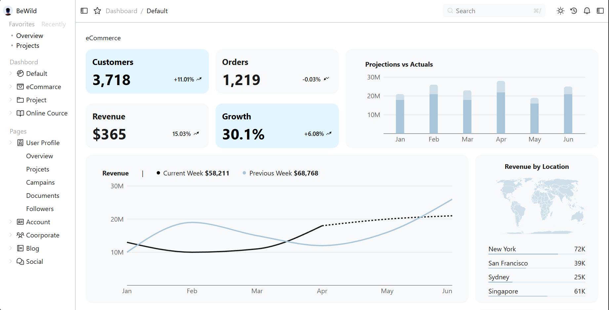

# Dashboard 

A modern, responsive **Dashboard** built with:

- React
- TypeScript
- Tailwind CSS

This project provides a clean and modular architecture for building interactive dashboards with support for dynamic data, charts (e.g., Recharts), dark mode, and responsive layout handling.

---

##  Features

-  Data visualizations with Recharts (line, bar, and donut charts)
-  Fully responsive layout using Tailwind CSS Grid
-  Dark mode support
-  Reusable components (Sidebar, Navbar, Cards, Charts, etc.)
-  Type-safe props and state management with TypeScript
-  Clean and minimal UI with custom utility classes

---

## 🛠️ Tech Stack

- [React](https://reactjs.org/)
- [TypeScript](https://www.typescriptlang.org/)
- [Tailwind CSS](https://tailwindcss.com/)
- [Recharts](https://recharts.org/) (for charts)
- [Vite](https://vitejs.dev/) or [CRA](https://create-react-app.dev/) (adjust as needed)

---

##  Getting Started

### 1. Clone the repository

```bash
git clone https://github.com/NoOne-Cares/ReactDashboard.git
cd DASHBOARD
```
### 2. Install dependencies

```bash
pnpm install
# or
npm install
```
### 3. Start the development server
```bash
npm run dev
# or
yarn dev
```

----

##  Screenshot

